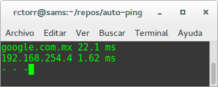

# auto-ping

Realiza ping a google.com.mx y al gateway (lo determina de forma automática) y muestra los resultados de forma compacta en una terminal

### Dependencias
* De sistema:
  * fping: https://github.com/rctorr/fping
* De python:
  * netaddr
  * fping: https://github.com/rctorr/fping.py

### Instalación
* Instala el comando fping para ello hay que seguir las instrucciones mostradas en https://github.com/rctorr/fping
* Clonar el repo de auto-ping.py:

  ```bash
  $ git clone https://github.com/rctorr/auto-ping.git
  ...
  $ cd auto-ping
  [auto-ping] $ 
  ```
* Crear un hambiente virtual y activarlo:

  ```bash
  [auto-ping] $ virtualenv venv
  ...
  [auto-ping] $ . venv/bin/activate
  (venv)[auto-ping] $ 
  ```
* Instalar netaddr:

  ```bash
  (venv)[auto-ping] $ pip install netaddr
  ...
  (venv)[auto-ping] $ 
  ```
* Instalar fping.py:

  ```bash
  (venv)[auto-ping] $ cd ..
  (venv)[~] $ git clone https://github.com/rctorr/fping.py.git
  ...
  (venv)[~] $ cd fping.py
  (venv)[fping.py] $ python setup.py install
  ...
  (venv)[fping.py] $ 
  
  ```

### Ejecución:

La finalidad de `auto-ping.py` es contar con una prueba referenciada de que tan estable está nuestra conexión a Internet en todo momento, por esa razón se ejecutan dos ping simultáneamente, uno hacia google.com.mx y otro hacia la dirección ip la puerta de salida (gateway). El gateway se determina de forma automática (esta versión funciona para plataforma Linux y posiblemente en Mac OSX).

Para ejecutar el script sólo hay que hacer lo siguiente:

```bash
(venv)[fping.py] $ cd ..
(venv)[~] $ cd auto-ping
(venv)[auto-ping] $ chmod +x auto-ping.py
(venv)[auto-ping] $ ./auto-ping.py
google.com.mx 26.0 ms
192.168.254.4 1.87 ms
- - - - -
```

el script se mantiene funcionando de forma indefinida hasta que se preciona la combinación de teclas Control+C
